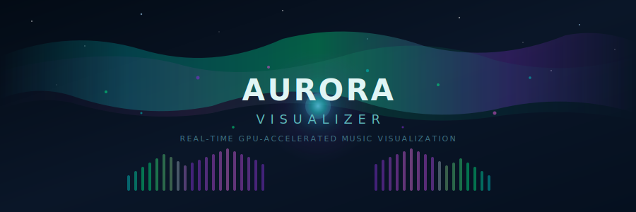

<p align="center">
  
</p>

<p align="center">
  <b>A GPU-accelerated real-time music visualizer with Aurora Borealis aesthetics.</b><br/>
  <sub>Captures system audio. Renders reactive visuals at 60fps. Pure Python + OpenGL.</sub>
</p>

<p align="center">
  
  
  
  
  
</p>

<br/>

> *Think planetarium laser show crossed with a rave — everything reacts to your music in real time.*

<br/>

## Quick Start

```bash
git clone https://github.com/stefanbocane/Audio-Visualizer-.git
cd Audio-Visualizer-
pip install -r requirements.txt
python3 main.py
```

> Picks up system audio automatically if [BlackHole](#-audio-setup-blackhole) is configured, otherwise falls back to microphone input. Runs in demo mode if no audio device is available.

<br/>

---

<br/>

## Visual Elements

The visualizer layers **8 distinct visual systems** that each react to different aspects of your music — bass, treble, beats, drops, stereo width, and overall energy.

<br/>

<table>
<tr>
<td width="50%">

### Aurora Background
3-layer flowing curtains using **domain-warped fractal noise** with a twinkling starfield and cosmic dust. Colors shift from cool teals during quiet passages to intense violets during loud sections.

</td>
<td width="50%">

### Central Orb
A **morphing energy sphere** with noise-distorted edges and internal plasma swirl. Pulses outward on beats with colored ripple rings. Never flashes white.

</td>
</tr>
<tr>
<td>

### Particle System
**3,500 particles** in four spiral arms with murmuration-like flocking. Scatter on beats, explode outward on drops. Colored through the aurora palette by speed and distance.

</td>
<td>

### DNA Double Helix
Stereo waveform (L/R channels) as two intertwined **glowing ribbon strands** with 64 energy bridge rungs. Twist rate accelerates with energy.

</td>
</tr>
<tr>
<td>

### Frequency Bars
**128 spectrum analyzer bars** in a gentle arc. Aurora color gradient from teal base to violet peaks, glowing edges, tip caps with trails, and mirror reflections.

</td>
<td>

### Warp Tunnel
**Corkscrew spiral rays** in 3 parallax depth layers with nebula noise texture. Activates at moderate energy, dramatically accelerates on drops.

</td>
</tr>
<tr>
<td>

### Shockwave Rings
Expanding **colored rings** triggered by bass drops. Teal-tinted, never white.

</td>
<td>

### Lissajous Scope
Small **stereo phase oscilloscope** in the corner showing L/R channel correlation.

</td>
</tr>
</table>

<br/>

### Post-Processing Chain

| Effect | Description |
|--------|-------------|
| **Bloom** | Soft colored extraction with 13-tap Gaussian blur at half resolution |
| **Chromatic Aberration** | RGB channel split that pulses with beat intensity |
| **Color Grading** | Shadows tinted teal, highlights shifted violet |
| **Motion Blur** | Frame-to-frame feedback for smooth trails |
| **Film Grain** | Subtle noise texture weighted to dark areas |
| **Vignette** | Edge darkening that breathes with energy |

<br/>

---

<br/>

## Audio Setup (BlackHole)

[BlackHole](https://existential.audio/blackhole/) is a free virtual audio driver that captures system audio digitally — no microphone, zero noise, works with headphones.

<br/>

### 1. Install

```bash
brew install blackhole-2ch
```

### 2. Approve & Restart

Go to **System Settings > Privacy & Security**, click **Allow** next to the BlackHole message. **Restart your Mac** (required).

### 3. Create Multi-Output Device

1. Open **Audio MIDI Setup** (`Cmd+Space` → "Audio MIDI Setup")
2. Click **+** in the bottom-left → **Create Multi-Output Device**
3. Check both your **speakers/headphones** AND **BlackHole 2ch**
4. Ensure speakers are listed **first** (Primary Device)

### 4. Set as Output

Right-click the **Multi-Output Device** in the sidebar → **"Use This Device For Sound Output"**

> [!NOTE]
> Multi-Output Devices disable macOS volume keys. Control volume from your music app instead (Spotify, Apple Music, etc.).

<br/>

<details>
<summary><b>Without BlackHole</b></summary>
<br/>

Without BlackHole, the visualizer falls back to your **default microphone**:
- Picks up room noise
- Doesn't work with headphones
- Quieter music may not register

If no audio device is found, the app runs in **demo mode** with synthetic animated data.

</details>

<br/>

---

<br/>

## Controls

```
python3 main.py
```

A launch menu lets you pick resolution (720p / 1080p / Fullscreen).

| Key | Action |
|:---:|--------|
| `Q` / `Esc` | Quit |
| `F` | Toggle fullscreen |

The HUD displays **BPM** (detected) and **FPS** in the top-left corner.

<br/>

---

<br/>

## Architecture

```
aurora-visualizer/
├── main.py                     # Launch menu, game loop, audio→render bridge
├── audio/
│   ├── capture.py              # Sounddevice stream, ring buffer (256-frame blocks)
│   ├── analyzer.py             # 1024-sample FFT, 6-band decomposition, stereo width
│   └── beat_detector.py        # Adaptive beat/drop detection (1.3σ / 2.2σ thresholds)
├── renderer/
│   ├── context.py              # ModernGL context, FBOs, shader loading
│   ├── pipeline.py             # Orchestrates all renderers + post-processing
│   ├── bloom.py                # Extract → 2-pass 13-tap Gaussian blur
│   ├── background.py           # Aurora curtains (FBM noise)
│   ├── orb.py                  # Central orb + beat ripple state machine
│   ├── particles.py            # 3500 particles, CPU physics (NumPy vectorized)
│   ├── dna_helix.py            # Stereo waveform helix with bridge rungs
│   ├── frequency_bars.py       # 128-bar spectrum analyzer
│   ├── warp_tunnel.py          # Radial corkscrew tunnel overlay
│   ├── shockwave.py            # Expanding ring on drops
│   ├── lissajous.py            # Stereo phase scope
│   └── hud.py                  # BPM/FPS text overlay
├── shaders/
│   └── *.vert / *.frag         # GLSL 4.1 shaders for each element
├── utils/
│   ├── math_utils.py           # Exponential smoothing, SmoothedAudioState
│   └── color_palette.py        # Aurora color definitions
└── requirements.txt
```

<br/>

### Render Pipeline

```
Audio In ──→ FFT ──→ Beat Detection ──→ Smoothing ──→ Scene Render ──→ Bloom ──→ Composite ──→ Display
  ~6ms        23ms        <1ms              <1ms         per element     half-res    + post-fx      vsync
                                                         additive blend
```

**Total audio-to-visual latency: ~25ms**

<br/>

---

<br/>

## Performance

| Metric | Value |
|--------|-------|
| Target framerate | 60fps (vsync), capped at 120fps |
| Particle count | 3,500 with 6-position trails (21,000 GL_POINTS/frame) |
| Particle physics | CPU — NumPy vectorized (no compute shaders on macOS) |
| Bloom resolution | Half (for performance) |
| Tested hardware | M1/M2 MacBook Air @ 1080p — solid 60fps |

<details>
<summary><b>If performance is low</b></summary>
<br/>

- Use **720p** instead of 1080p from the launch menu
- Close other GPU-intensive apps (Chrome, etc.)
- Reduce `NUM_PARTICLES` in `renderer/particles.py`

</details>

<br/>

---

<br/>

## Troubleshooting

<details>
<summary><b>"No audio device found" / Demo mode</b></summary>
<br/>

- Ensure BlackHole is installed and the system extension was approved
- You must **restart** after approving the extension
- Verify the Multi-Output Device is set as system output in Audio MIDI Setup

</details>

<details>
<summary><b>Volume keys don't work</b></summary>
<br/>

macOS limitation with Multi-Output Devices. Use your music app's volume slider instead.

</details>

<details>
<summary><b>Shader compile error</b></summary>
<br/>

- Requires OpenGL 4.1 (all Macs from 2012+ support this via Metal)
- Check that shader files aren't corrupted

</details>

<details>
<summary><b>Choppy / laggy visuals</b></summary>
<br/>

- Lower the resolution via the launch menu
- Close Chrome and other GPU-heavy apps
- Ensure you're on the discrete GPU if your Mac has one

</details>

<br/>

---

<br/>

## Dependencies

| Package | Version | Purpose |
|---------|---------|---------|
| [`moderngl`](https://github.com/moderngl/moderngl) | >= 5.8 | OpenGL 4.1 context, shaders, FBOs, VAOs |
| [`pygame`](https://www.pygame.org/) | >= 2.5 | Window management, event loop, HUD text |
| [`sounddevice`](https://python-sounddevice.readthedocs.io/) | >= 0.4 | Real-time audio capture from system devices |
| [`numpy`](https://numpy.org/) | >= 1.24 | FFT analysis, particle physics, array math |

<br/>

---

<br/>

## License

MIT — do whatever you want with it.

<br/>

---

<p align="center">
  <sub>Built with <a href="https://claude.ai/claude-code">Claude Code</a></sub>
</p>
